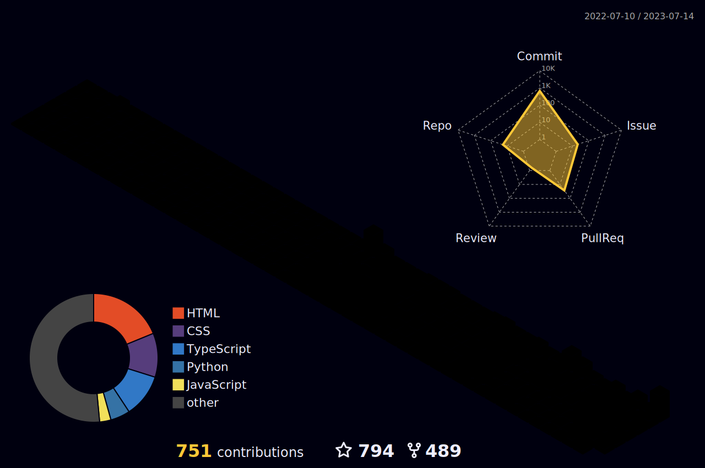

# Hi there 👋

<h1 align="center">
  
</h1>
<!-- knock code pictures 敲代码的图片 -->

 

<!--  skill badge 技能徽章 -->
💪 正在学习

&emsp;&emsp;

🧠 计划学习

&emsp;&emsp;

🧰 常用的工具

&emsp;&emsp; 

<!-- programming tool icon 编程工具图标 -->

<!-- img -->
 

<!-- svg -->

  
  
  
  
   
  
  
  
  
  
  

 

<!-- gif -->

<!-- just img 图片-->

<!-- profile-3d-contrib 3D贡献图-->

<!-- just img 图片 -->

<!-- just img 图片 -->

 

<!-- Joke 笑话 -->

<!-- Quotes 名人名言 -->

### Metrics
![Metrics](https://metrics.lecoq.io/it985?template=classic&chess=1&fortune=1&poopmap=1&screenshot=1&splatoon=1&projects=1&gists=1&code=1&traffic=1&activity=1&notable=1&achievements=1&calendar=1&starlists=1&discussions=1&repositories=1&people=1&followup=1&habits=1&stars=1&topics=1&lines=1&stargazers=1&languages=1&isocalendar=1&base=header%2C%20activity%2C%20community%2C%20repositories%2C%20metadata&base.indepth=false&base.hireable=false&base.skip=false&repositories.batch=100&repositories.forks=false&repositories.affiliations=owner&isocalendar=false&isocalendar.duration=full-year&languages=false&languages.limit=8&languages.threshold=0%25&languages.other=false&languages.colors=github&languages.sections=most-used&languages.indepth=false&languages.analysis.timeout=15&languages.analysis.timeout.repositories=7.5&languages.categories=markup%2C%20programming&languages.recent.categories=markup%2C%20programming&languages.recent.load=300&languages.recent.days=14&stargazers=false&stargazers.charts=true&stargazers.charts.type=classic&stargazers.worldmap=false&stargazers.worldmap.sample=0&lines=false&lines.sections=base&lines.repositories.limit=4&lines.history.limit=1&topics=false&topics.mode=starred&topics.sort=stars&topics.limit=15&stars=false&stars.limit=4&habits=false&habits.from=200&habits.days=14&habits.facts=true&habits.charts=false&habits.charts.type=classic&habits.trim=false&habits.languages.limit=8&habits.languages.threshold=0%25&followup=false&followup.sections=repositories&followup.indepth=false&followup.archived=true&people=false&people.limit=24&people.identicons=false&people.identicons.hide=false&people.size=28&people.types=followers%2C%20following&people.shuffle=false&repositories=false&repositories.pinned=0&repositories.starred=0&repositories.random=0&repositories.order=featured%2C%20pinned%2C%20starred%2C%20random&discussions=false&discussions.categories=true&discussions.categories.limit=0&starlists=false&starlists.limit=2&starlists.limit.repositories=2&starlists.languages=false&starlists.limit.languages=8&starlists.shuffle.repositories=true&calendar=false&calendar.limit=1&achievements=false&achievements.threshold=C&achievements.secrets=true&achievements.display=detailed&achievements.limit=0&notable=false&notable.from=organization&notable.repositories=false&notable.indepth=false&notable.types=commit&notable.self=false&activity=false&activity.limit=5&activity.load=300&activity.days=14&activity.visibility=all&activity.timestamps=false&activity.filter=all&traffic=false&code=false&code.lines=12&code.load=400&code.days=3&code.visibility=public&gists=false&projects=false&projects.limit=4&projects.descriptions=false&chess=false&chess.user=.user.login&chess.animation=%7B%0A%20%20%22size%22%3A%2040%2C%0A%20%20%22delay%22%3A%203%2C%0A%20%20%22duration%22%3A%200.6%0A%7D%0A&fortune=false&poopmap=false&poopmap.days=7&screenshot=false&screenshot.title=Screenshot&screenshot.url=https%3A%2F%2Fwww.tryrun.top&screenshot.selector=body&screenshot.mode=image&screenshot.viewport=%7B%0A%20%20%22width%22%3A%201280%2C%0A%20%20%22height%22%3A%201280%0A%7D%0A&screenshot.wait=0&screenshot.background=true&splatoon=false&splatoon.sections=player%2C%20versus%2C%20salmon-run&splatoon.versus.limit=1&splatoon.salmon.limit=1&splatoon.statink=false&splatoon.source=splatnet&config.timezone=Asia%2FShanghai)

<h1 align="center">🎯 𝙼𝚎𝚝𝚛𝚒𝚌𝚜</h1>

<!-- just img 图片 -->

<!-- GitHub metrics 信息指标 -->

  
<!-- first form 第一个表格 -->
<table>
  <tr>
    <td></td>
  </tr>
</table>

<!-- second form 第二个表格 -->
<table>
  <tr>
    <td></td>
    <td></td>
  </tr>
  <tr>
    <td></td>
    <td></td>
  </tr>
  <tr>
    <td></td>
    <td></td>
  </tr>
  <tr>
    <td></td>
    <td></td>
  </tr>
  <tr>
    <td></td>
    <td></td>
  </tr>
  <tr>
    <td></td>
    <td></td>
  </tr>
  <tr>
    <td></td>
    <td></td>
  </tr>
</table>

### GitHub Stats Card

### Most used languages

### Github Profile Trophy

### GitHub Readme Activity Graph

### GitHub streak

    

<!-- just img 图片 -->

